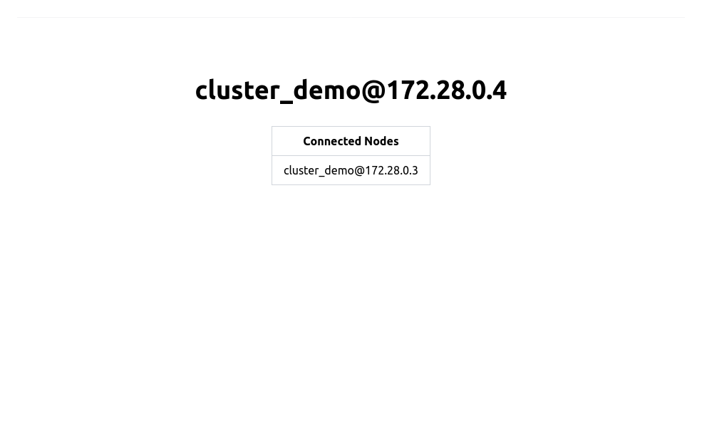
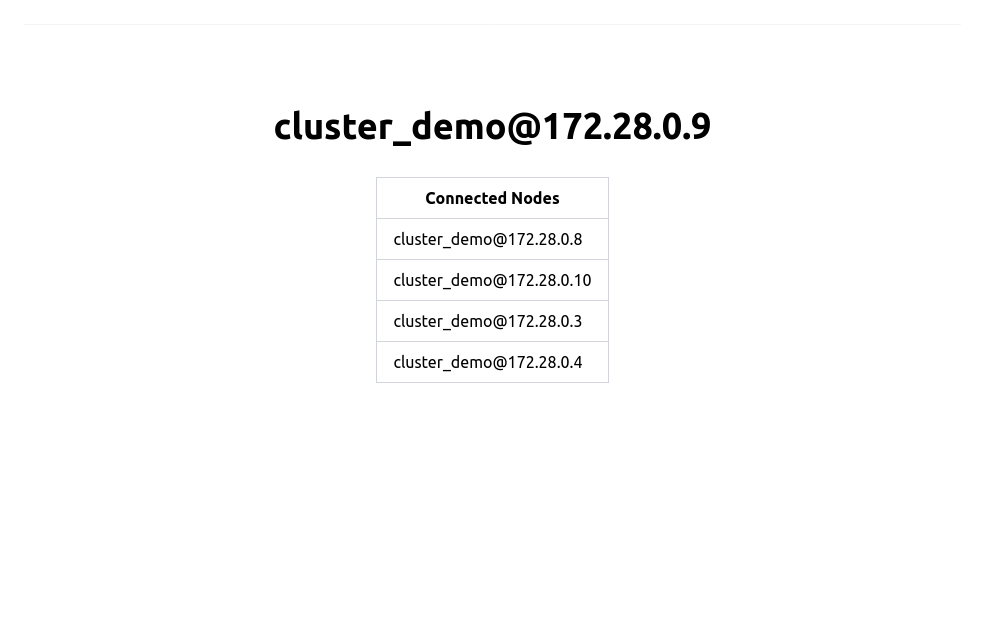

# Elixir Phoenix DNSCluster & Docker Swarm

This repository contains a simple Elixir Phoenix application that demonstrates how to use the `DNSCluster` library to enable service discovery in a Docker Swarm environment. The application is configured to run with 2 replicas and a basic webpage is configured at the root address to display the current node as well as all known nodes in the cluster.

## Example

Deploying the stack via Docker Swarm:

`docker stack deploy --compose-file compose.yaml --with-registry-auth cluster_demo`



Notice the container node name contains an IP within the range of the overlay network. 

Scaling up...

`docker service update --replicas 5 cluster_demo_cluster_demo`



## Notable Configurations

[env.sh.eex](rel/env.sh.eex) 

```
export RELEASE_DISTRIBUTION=name
export RELEASE_NODE=<%= @release.name %>@$(hostname -i)
export RELEASE_COOKIE=cluster_demo
```

This file sets environment variables as outlined in the [official documentation](https://hexdocs.pm/mix/Mix.Tasks.Release.html#module-environment-variables). It sets the distribution to long names, configures a long name using the container IP, and sets a static cookie to enable communication between nodes.


[application.ex](lib/cluster_demo/application.ex)

```
defmodule ClusterDemo.Application do
  @moduledoc false

  use Application

  @impl true
  def start(_type, _args) do
    children = [
      {DNSCluster, query: "tasks.cluster_demo"},        # <-- Look here!
      {Phoenix.PubSub, name: ClusterDemo.PubSub},
      ClusterDemoWeb.Endpoint
    ]

    opts = [strategy: :one_for_one, name: ClusterDemo.Supervisor]
    Supervisor.start_link(children, opts)
  end

  @impl true
  def config_change(changed, _new, removed) do
    ClusterDemoWeb.Endpoint.config_change(changed, removed)
    :ok
  end
end

```

The [DNSCluster](https://hexdocs.pm/dns_cluster/DNSCluster.html) configuration is set to query `tasks.cluster_demo` which is an internal service discovery address published by Docker Swarm. This address will resolve to the IP addresses of all running tasks in the `cluster_demo` service.


[compose.yaml](./compose.yaml)

```
version: "3.8"

services:
  cluster_demo:
    build: .
    image: <your_published_image>
    networks:
      - cluster_demo_network
    deploy:
      replicas: 2
      update_config:
        parallelism: 1
        delay: 10s
        failure_action: rollback
        order: start-first
      restart_policy:
        condition: always
    environment:
      # Can be any value, 64+ characters long
      SECRET_KEY_BASE: "aaaaaaaaaaaaaaaaaaaaaaaaaaaaaaaaaaaaaaaaaaaaaaaaaaaaaaaaaaaaaaaaaaaaaaaaaaaaaa"

networks:
 cluster_demo_network:
   driver: overlay
   ipam:
     config:
       - subnet: 172.28.0.0/24
```

The `cluster_demo` service is configured to run with 2 replicas and is connected to an overlay network. The `DNSCluster` library will query the `tasks.cluster_demo` address to resolve the IP addresses of all running tasks in the `cluster_demo` service. An overlay network is created to allow the tasks to communicate with each other. The `SECRET_KEY_BASE` environment variable is set to a dummy value to allow the application to start.